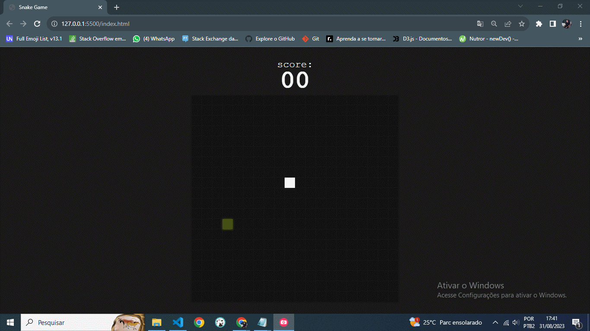

#🕹 Snake Game

Projeto de criação do famoso jogo da Cobrinha "Snake".

Aplicação desenvolvida com JavaScript, HTML5 e CSS3.

## Pré-requisitos

Visual Studio Code

Para teste local utilize a extensão LiveServer : ritwickdey.LiveServer

## Uso
Clone o Projeto no GitHub:
https://github.com/1andersonmotta/SnakeGame.git 
Abra o projeto com Visual Studio Code e abra o Arquivo index.html com Live Server

## 🛠 Ferramentas

- [JavaScript](https://developer.mozilla.org/pt-BR/docs/Web/JavaScript)
- [HTML](https://developer.mozilla.org/pt-BR/docs/Web/HTML)
- [CSS](https://developer.mozilla.org/pt-BR/docs/Web/CSS)

## Contribuição

Se você tem alguma Sugestão enviar para devandersonmotta@gmail.com com o assunto: "contribuição Snake Game" ou entre em contato pelo Linkedin.

## Licença

MIT

## ✉ Contato

email: devandersonmotta@gmail.com

linkedin: www.linkedin.com/in/anderson-motta-96b138235
---

## 💡 Objetivo

Praticar e adquirir conhecimento. 

